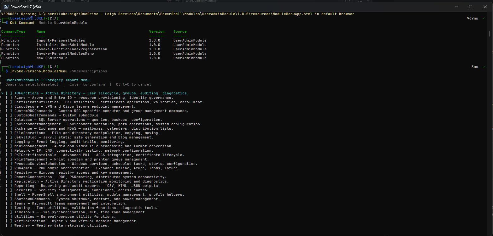

# Bring Your Own Functions
{: .no_toc }

UserAdminModule does not ship your admin functions — it manages them. Any collection of `.ps1` files can be brought in. This page shows how to organise an existing library and what it looks like in practice.

## Table of contents
{: .no_toc .text-delta }

1. TOC
{:toc}

---

## A Real-World Example

Consider an administrator's function library built up over years of daily AD and Exchange work. Before UserAdminModule it lives on disk as loose scripts, dot-sourced from a fragile `$PROFILE`. After UserAdminModule it looks like this:

```
C:\MyModules\AdminFunctions\
├── ADFunctions\          ← Active Directory — users, groups, computers, OU management
├── Azure\               ← Azure resource tooling, subscriptions, resource groups
├── Exchange\            ← Exchange Online and on-premises mailbox management
├── Network\             ← Connectivity tests, DNS, port scanning
├── Security\            ← Audit logs, privileged group reporting, compliance
├── FileOperations\      ← Bulk file management, ACL reporting
├── Reporting\           ← User audit reports, licence reports, export tooling
├── CertificateUtils\    ← Certificate lifecycle and PKI tooling
└── Utilities\           ← Miscellaneous helpers and converters
```

Each folder contains a `.psm1` and a `Public\` subfolder. UserAdminModule discovers all of them automatically from the configured `CustomModulesPath`.

**Importing any category is one command:**

```powershell
Import-PersonalModules -Category ADFunctions
Import-PersonalModules -Category Exchange
```

**Or browse and select interactively:**

```powershell
Invoke-PersonalModulesMenu -ShowDescriptions
```



Select one or more categories with **Space**, then press **Enter** to import them all at once.

---

## Folder Structure Requirements

A folder qualifies as a discoverable UserAdminModule category when it contains a `.psm1` file whose name matches the folder name exactly:

```
ADFunctions\
├── ADFunctions.psm1    ← required — filename must match folder name
└── Public\
    ├── Get-ADUserSearch.ps1
    ├── Reset-ADUserPassword.ps1
    └── Get-LockedOutAccounts.ps1
```

The `.psm1` dot-sources every `.ps1` file in `Public\` automatically. `New-PSM1Module` generates this boilerplate for you, but if your folders already follow this shape they are already compatible.

{: .tip }
> `Public\` and `Private\` are **not** picked up as false-positive categories — they contain no matching `.psm1`, so the discovery logic skips them.

---

## Converting an Existing Library

### Step 1 — Scaffold a `.psm1` for each category

```powershell
New-PSM1Module -folderPath 'C:\MyModules\AdminFunctions\ADFunctions'
New-PSM1Module -folderPath 'C:\MyModules\AdminFunctions\Exchange'
New-PSM1Module -folderPath 'C:\MyModules\AdminFunctions\Network'
```

### Step 2 — Move your functions into `Public\`

```
ADFunctions\
└── Public\
    ├── Get-ADUserSearch.ps1     ← moved from loose scripts
    └── Reset-ADUserPassword.ps1
```

Your function code does not need any changes — only the file location moves.

### Step 3 — Point UserAdminModule at your library root

```powershell
Initialize-UserAdminModule -Path 'C:\MyModules\AdminFunctions'
```

### Step 4 — Import and verify

```powershell
Import-PersonalModules -Category ADFunctions
Get-Command -Module ADFunctions
```

---

## What Example Functions Look Like

Here is a representative sample of the kinds of functions an administrator would manage in each category:

| Category | Example Functions |
|---|---|
| **ADFunctions** | `Get-ADUserSearch`, `Reset-ADUserPassword`, `Get-LockedOutAccounts`, `Get-StaleADUserReport`, `Get-DirectReports`, `Move-ADUser`, `Get-FSMORoleOwner` |
| **Exchange** | `Connect-O365Exchange`, `Get-MailboxPermissions`, `Get-DistributionListMembers`, `Copy-DistributionGroupMembership`, `New-HybridSharedMailbox`, `Get-MessageTraceFiltered` |
| **Azure** | `Connect-AzureEnvironment`, `Get-AzureResourceReport`, `Get-AzureSubscriptions` |
| **Network** | `Test-PortConnectivity`, `Get-DNSResolution`, `Invoke-NetworkScan` |
| **Security** | `Get-AuditLogReport`, `Get-PrivilegedGroupMembers`, `Find-InactiveAccounts` |
| **Reporting** | `New-UserAuditReport`, `Export-ADReport`, `Get-LicenceReport` |
| **CertificateUtils** | `Get-CertificateExpiry`, `New-SelfSignedCertificate`, `Export-CertificateToFile` |
| **Utilities** | `Convert-FileSize`, `Get-FolderSize`, `Invoke-BulkRename` |

---

## Browsing and Indexing Your Library

After setting up your library, open the HTML browser:

```powershell
# Rebuild the function index and HTML browser, then open it
Open-ModuleMenuApp -Regenerate
```

`-Regenerate` runs `Invoke-FunctionIndexRegeneration` automatically if the index does not exist, then rebuilds the HTML browser from scratch. Run it whenever you add or remove functions.

To rebuild the index separately without opening the browser:

```powershell
Invoke-FunctionIndexRegeneration
```

The browser shows synopsis, parameters, examples, and notes for every function — pulled directly from comment-based help.

---

## Sharing Your Library

Because each category is a self-contained `.psm1` folder, your library can be:

- **Committed to Git** alongside your infrastructure code — version-controlled and reviewable
- **Shared with colleagues** by pointing `Initialize-UserAdminModule -Path` at the same network share or cloned repository path
- **Deployed to new machines** instantly — `git clone` the repo, run `Initialize-UserAdminModule`, done

No more zipping scripts and explaining dot-sourcing over Teams.
