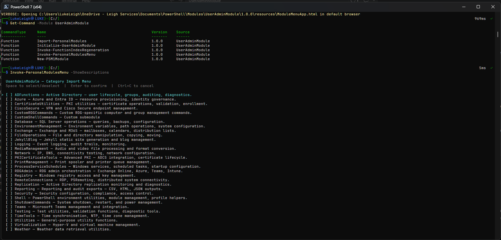
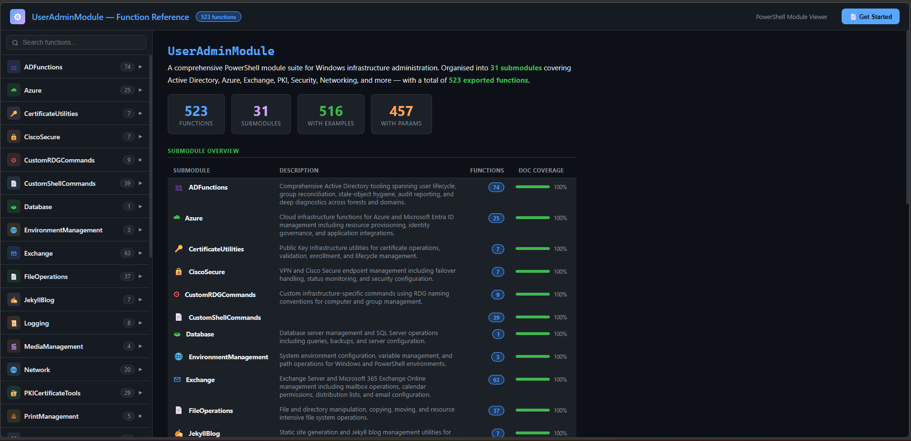
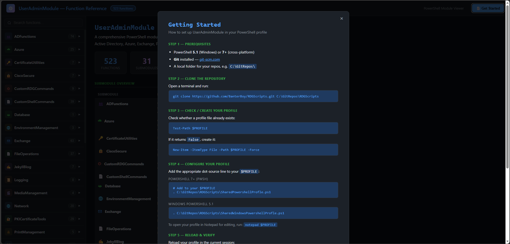

# Framework Reference
{: .no_toc }

## Table of contents
{: .no_toc .text-delta }

1. TOC
{:toc}

---

## Framework Functions

These five functions are exported by UserAdminModule and available in your session after `Import-Module UserAdminModule`.

---

### Import-PersonalModules

Imports a category of personal PowerShell functions into the current session. The `-Category` parameter is dynamically tab-completed from available submodule folders discovered at runtime — no hardcoded list, no `ValidateSet` to maintain.

```powershell
Import-PersonalModules -Category <CategoryName> [-Verbose]
```

| Parameter | Type | Description |
|---|---|---|
| `-Category` | String (dynamic) | Name of the category folder to import. Tab-completes from discovered folders in both the module root and `CustomModulesPath`. |

**Examples:**

```powershell
# Import all AD functions
Import-PersonalModules -Category ADFunctions

# Import Exchange functions with verbose output
Import-PersonalModules -Category Exchange -Verbose
```

---

### Initialize-UserAdminModule

One-time setup command. Writes `config.json` to `$env:APPDATA\UserAdminModule\` and optionally adds a profile line to your `$PROFILE`.

```powershell
Initialize-UserAdminModule -Path <string> [-UpdateProfile] [-UseSharedProfile] [-Verbose]
```

| Parameter | Type | Description |
|---|---|---|
| `-Path` | String | Path to your custom modules root folder. Created automatically if it does not exist. |
| `-UpdateProfile` | Switch | Appends a line to the current `$PROFILE` if not already present. By default, appends `Import-Module UserAdminModule`. Combine with `-UseSharedProfile` to append a dot-source line for the full shell UX instead. |
| `-UseSharedProfile` | Switch | When combined with `-UpdateProfile`, writes a dynamic resolution block to `$PROFILE` that locates the newest installed version of the shared profile at each session startup. On PS 7+ it loads `SharedPowershellProfile.ps1`; on PS 5.1 it loads `SharedWindowsPowershellProfile.ps1`. The correct file is chosen automatically based on `$PSEdition`. Version-upgrade-proof — `Update-Module` takes effect automatically without re-running this command. |

**Examples:**

```powershell
# Minimal setup — Import-Module line only
Initialize-UserAdminModule -Path 'C:\MyModules\AdminFunctions' -UpdateProfile

# Full shell UX — dot-source the shared profile (auto-detects PS edition)
Initialize-UserAdminModule -Path 'C:\MyModules\AdminFunctions' -UpdateProfile -UseSharedProfile
```

---

### Invoke-PersonalModulesMenu

Launches an interactive multi-select terminal menu for choosing and importing categories. Navigate with arrow keys, **Space** to select/deselect, **Enter** to confirm. All available categories are discovered dynamically at runtime — no reconfiguration needed when new submodules are added.

```powershell
Invoke-PersonalModulesMenu [-ShowDescriptions] [-Verbose]
```

| Parameter | Type | Description |
|---|---|---|
| `-ShowDescriptions` | Switch | Appends a short description to each category name in the menu, as shown below. |

**Examples:**

```powershell
# Basic menu — category names only
Invoke-PersonalModulesMenu

# Menu with descriptions for each category
Invoke-PersonalModulesMenu -ShowDescriptions
```



The menu lists every discovered category from both the module root and your configured `CustomModulesPath`. Select one or more categories, press **Enter**, and they are imported into the current session.

{: .note }
> `Invoke-PersonalModulesMenu` requires the **PSMenu** module. If it is not installed, the function exits with a warning and the install command: `Install-Module PSMenu`

---

### Invoke-FunctionIndexRegeneration

Scans all discovered category folders, extracts comment-based help from each `.ps1` file in `Public\`, and regenerates `FunctionIndex.json` and `FunctionIndex.md` in the module root.

```powershell
Invoke-FunctionIndexRegeneration [-Verbose]
```

Run this after adding or removing functions. You can also trigger this automatically via `Open-ModuleMenuApp -Regenerate`, which calls it if the index does not exist.

{: .important }
> `FunctionIndex.json` and `FunctionIndex.md` are auto-generated. Do not edit them manually — changes will be overwritten on the next regeneration.

---

### New-PSM1Module

Scaffolds a new category folder with the full UserAdminModule-compatible structure: a `.psm1` file that auto-dot-sources `Public\`, plus `Public\`, `Private\`, `Classes\`, `Configuration\`, and `Resources\` subfolders.

```powershell
New-PSM1Module -folderPath <string> [-Verbose]
```

| Parameter | Type | Description |
|---|---|---|
| `-folderPath` | String | Full path for the new module folder. The `.psm1` filename is derived from the folder name. |

**Example:**

```powershell
New-PSM1Module -folderPath 'C:\MyModules\ADFunctions'
```

---

## Shell UX Functions

These functions are loaded into the **global** scope when `Import-Module UserAdminModule` runs. They provide prompt, console, and session UX helpers — available immediately without importing any category.

---

### Open-ModuleMenuApp

Opens the UserAdminModule Function Reference browser — a self-contained HTML app — in your default browser. The app shows all exported functions across all discovered submodules, with a searchable left-hand category panel and full comment-based help on the right.

```powershell
Open-ModuleMenuApp [-Regenerate]

# Short alias
omma
```

| Parameter | Type | Description |
|---|---|---|
| `-Regenerate` | Switch | Ensures `FunctionIndex.json` is up to date (calling `Invoke-FunctionIndexRegeneration` automatically if needed), then rebuilds `ModuleMenuApp.html` before opening it. Use this after adding or removing functions. |

**Examples:**

```powershell
# Open the existing HTML browser
Open-ModuleMenuApp

# Rebuild the index and HTML, then open
Open-ModuleMenuApp -Regenerate

# Same, using the alias
omma -Regenerate
```



The browser shows a **live count of all functions** across your submodules, a **DOC COVERAGE** indicator per category, and a **Search functions** field that filters across all names and descriptions in real time.

Click **Get Started** in the top-right corner for a step-by-step setup guide:



---

### Other Shell UX Functions

| Function | Description |
|---|---|
| `Set-PromptisAdmin` | Sets the PowerShell prompt to display elevation status |
| `Show-IsAdminOrNot` | Displays whether the current session is running as administrator |
| `Set-TitleisAdmin` | Sets the console window title to show username, privilege level, and current path |
| `New-Greeting` | Displays a time-of-day greeting with system info on profile load |
| `Get-ConsoleConfig` | Returns current console font, size, and colour configuration |
| `Set-ConsoleConfig` | Applies console font, size, and colour settings |
| `Set-Home` | Sets the working directory to the user's home folder |
| `Get-LocationStack` | Returns the current directory navigation stack |
| `Restore-Location` | Pops the location stack to return to a previous directory |
| `Restart-Profile` | Re-executes `$PROFILE` without starting a new shell process |
| `Install-RequiredModules` | Checks and installs module dependencies |
| `Install-ModuleIfNotPresent` | Installs a module only if it is not already available |
| `Invoke-UserAdminModuleRequiredModules` | Bootstraps all UserAdminModule dependencies |
| `Initialize-Module` | Internal module initialisation helper |
| `Test-IsAdmin` | Returns `$true` if the current session is running as administrator, `$false` otherwise |

---

## Configuration

UserAdminModule stores its configuration at:

```
$env:APPDATA\UserAdminModule\config.json
```

The configuration file is created by `Initialize-UserAdminModule`. Its primary key is `CustomModulesPath`, which tells all discovery functions where to scan for your category folders.

{: .warning }
> Do not edit `config.json` directly. Re-run `Initialize-UserAdminModule -Path <newpath>` to change the configured path.

---

## PS 5.1 and 7+ Compatibility

All framework and Shell UX functions target both Windows PowerShell 5.1 and PowerShell 7+. No `#Requires -PSEdition Core` restrictions apply — UserAdminModule works in the shell you already use.
